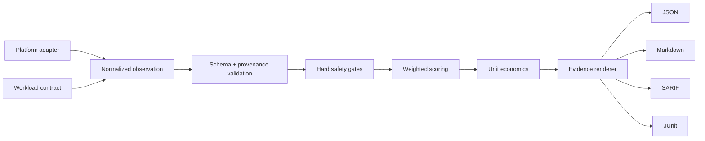

# AI Agent Infrastructure Benchmark

## AgentInfraBench

**Open-source AI agent security, sandbox isolation, cloud infrastructure, Kubernetes, DevSecOps, FinOps and production-readiness benchmarking.**

AgentInfraBench converts reproducible workload observations into procurement-grade scorecards for AI coding-agent infrastructure. It compares the things that token-price tables omit: isolation, identity, egress, approvals, recovery, evidence quality and **cost per accepted outcome**.

```text
workload + platform observation + evidence provenance
  -> hard safety gates
  -> weighted benchmark dimensions
  -> fully loaded unit economics
  -> JSON + Markdown + SARIF + JUnit evidence
```

> **Evidence boundary:** the included observations are transparent fixtures derived from public documentation or synthetic tests. They are not vendor certification, penetration-test results or independently reproduced production measurements. Scores become decision-grade only when a named operator executes the tests in a controlled environment and preserves the resulting evidence.

## Five-minute run

```bash
python3 -m agentinfrabench.cli run \
  scenarios/remote-futrx-documented.json \
  --output generated/remote-futrx

python3 -m unittest discover -s tests -v
```

The command produces:

- `result.json` — stable machine-readable result;
- `scorecard.md` — architecture and procurement summary;
- `results.sarif` — security findings for GitHub code scanning;
- `junit.xml` — CI-compatible hard-gate results.

## What is measured

| Dimension | Weight | Key signals |
|---|---:|---|
| Isolation | 22% | kernel boundary, tenant separation, resource ceilings |
| Identity and secrets | 18% | workload identity, expiry, encryption, project scoping |
| Network and exfiltration | 16% | default-deny egress, segmentation, proxy enforcement |
| Agent authority | 16% | approvals, browser writes, production mutations |
| Durability and recovery | 14% | checkpoints, idempotency, backups, failover |
| Observability and evidence | 8% | normalized events, provenance, immutable retention |
| Unit economics | 6% | fully loaded cost per independently accepted outcome |

Hard gates override the weighted score. A platform cannot average its way out of cross-tenant access, host-root execution, unapproved production mutation or unrecoverable external duplication.

## Included reference profiles

- `remote-futrx-documented.json` records public architectural statements from Remote's repository and threat model.
- `agentfabric-reference.json` describes the target contracts in [AgentFabric](https://github.com/AAH20/self-hosted-ai-agent-infrastructure-platform); unimplemented controls remain explicitly marked `design`.
- `rootless-personal-workspace.json` models a low-cost, single-trusted-user environment.

No fixture should be presented as a live test unless its evidence items use the `measured` provenance class.

## GitHub Action

```yaml
- uses: AAH20/ai-agent-infrastructure-benchmark@v1
  with:
    scenario: scenarios/rootless-personal-workspace.json
    output: agentinfra-results
```

The action uploads the evidence bundle as a workflow artifact. SARIF upload can be added by repositories with GitHub code-scanning permissions.

## Architecture



## Platform-adapter contract

An adapter does not award itself a score. It collects normalized facts:

```json
{
  "control": "network.default_deny_egress",
  "status": "pass",
  "provenance": "measured",
  "artifact": "evidence/egress-denied.json"
}
```

Accepted provenance classes:

- `measured` — produced by the current controlled execution;
- `documented` — supported by a cited public source;
- `synthetic` — deterministic fixture or fault-injection result;
- `design` — intended architecture, not implemented evidence.

`design` evidence contributes zero points and prevents a production-ready claim.

## Distribution and commercial path

The specification, runner and basic adapters are Apache-2.0. Distribution compounds through vendor-submitted adapters, public scorecards, GitHub Actions, procurement templates and reproducible improvement PRs.

Commercial services can include controlled private benchmarks, signed attestations, architecture remediation, continuous regression evaluation and managed agent infrastructure. See [unit economics and packaging](docs/commercial-model.md).

## Contributing

Platform vendors are encouraged to contribute an adapter and reproducible evidence—not marketing claims. See [CONTRIBUTING.md](CONTRIBUTING.md) and the [benchmark methodology](docs/methodology.md).

## Call to action

Run a scenario against your agent infrastructure, publish the evidence boundary and open an adapter PR. For enterprise architecture and controlled assessments, visit [A2Z SOC](https://a2zsoc.com/).

## License

Apache-2.0.
